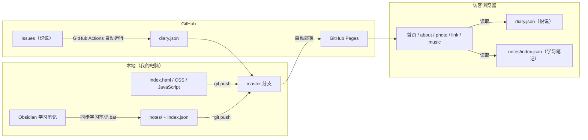

# luyuil_blog

一个零依赖、纯手写的个人博客。没有框架、没有构建步骤，全部由原生 HTML / CSS / JavaScript 构成，直接托管在 GitHub Pages 上。

**在线访问：** https://luyuil.github.io/luyuil_blog/

---

## 一、整体架构

整个博客可以概括为一句话：**静态页面 + 两份自动生成的数据文件**。



关键设计：**访客只读取站内的静态文件**（`diary.json`、`notes/`），不依赖任何第三方接口，因此速度快、稳定性好，也不会受 API 限流影响。

---

## 二、技术栈

| 项目 | 说明 |
| --- | --- |
| 前端 | 原生 HTML + CSS + JavaScript（无框架、无打包工具） |
| Markdown 渲染 | [marked](https://github.com/markedjs/marked)（已本地化到 `JavaScript/marked.min.js`，不依赖 CDN） |
| 托管 | GitHub Pages（`master` 分支根目录直接托管） |
| 自动化 | GitHub Actions（自动生成日记数据） |
| 数据存储 | GitHub Issues（说说）、Markdown 文件（学习笔记） |

---

## 三、目录结构

```
luyuil_blog/
├── index.html              # 首页（唯一页面，所有窗口都在这一个文件里）
├── CSS/
│   ├── style.css           # 主样式：窗口、卡片、图标、照片墙
│   ├── diary.css           # 日记窗口样式
│   └── study.css           # 学习笔记窗口样式
├── JavaScript/
│   ├── windowAnimation.js  # 窗口缩放动画（打开/关闭）
│   ├── script.js           # 主逻辑：图标、窗口、拖拽、照片墙、音效、about
│   ├── diary.js            # 日记（说说）：读取 + 管理模式发布
│   ├── study.js            # 学习笔记：目录树 + Markdown 渲染
│   └── marked.min.js       # Markdown 解析库（本地文件）
├── docs/about.md           # “about me” 窗口的内容（Markdown）
├── notes/                  # 学习笔记（由 Obsidian 自动同步进来）
│   ├── index.json          # 笔记索引（网页靠它列出目录）
│   └── 前端学习/ godot引擎学习/ ……
├── diary.json              # 说说数据（由 GitHub Actions 自动生成）
├── image/ music/           # 图片、视频背景、音乐
├── tools/
│   ├── sync_notes.py       # 把 Obsidian 笔记同步进仓库
│   └── update_diary.py     # 把 Issues 导出成 diary.json
├── .github/workflows/
│   └── update-diary.yml    # 收到说说/推送时自动更新 diary.json
├── 同步学习笔记.bat          # 双击同步笔记（调用 sync_notes.py --push）
└── .nojekyll               # 关闭 GitHub Pages 的 Jekyll，保证 .md 原样托管
```

---

## 四、功能模块与实现方式

| 模块 | 功能 | 实现要点 |
| --- | --- | --- |
| 首页门户 | 视频背景 + 头像卡片 + 5 个功能图标 | `<video>` 静音循环播放，配 `poster` 封面（视频压到 0.3MB，秒开） |
| 窗口系统 | 点击图标弹出窗口、可拖拽、✕ 关闭 | 统一 `.popup-window` 结构 + `animateWindow()` 缩放动画；拖拽用 `margin` 位移，避开 `transform` 冲突 |
| about | 显示个人简介 | `fetch('./docs/about.md')` + marked 渲染 |
| photo | 可拖拽的照片墙 + 点击看大图 | 随机摆放 + 边界限制；图片 `loading="lazy"` 懒加载，不拖慢首页 |
| link | 我的项目链接卡片 | `addProject(name, url)` 一行添加一个 |
| music | 背景音乐开关 | `new Audio()` + 图标旋转动画 |
| 按键音效 | 点击图标/按钮有音效 | 复用同一个 `Audio` 对象，`currentTime = 0` 支持连点重播 |
| 日记（说说） | 像朋友圈一样发图文说说，访客可看 | 数据存 GitHub Issues；Actions 导出 `diary.json`；访客只读；作者通过“管理模式”发布 |
| 学习笔记 | 左侧目录树 + 右侧 Markdown 内容 | 公开模式读 `notes/`（人人可看）；本地模式可用 File System Access API 直读 Obsidian 文件夹 |

### 日记的数据流

```
我发说说（管理模式 / 手机 GitHub App 发 Issue）
        ↓
GitHub Actions 监听到 issue 变化 → 运行 tools/update_diary.py
        ↓
生成/更新 diary.json → 自动提交到 master
        ↓
访客打开日记窗口 → fetch('./diary.json') → 渲染时间线
```

- **只有我本人能发**：写操作需要 GitHub 令牌，令牌只保存在我自己浏览器的 localStorage 里，代码和仓库中都没有；访客的浏览器没有令牌，所以只能看。
- **只显示我发的 issue**：`update_diary.py` 会过滤作者，陌生人在公开仓库开 issue 不会出现在日记里。

### 学习笔记的数据流

```
在 Obsidian 写笔记（D:\Obsidain_Note\Obsidian Note\学习笔记）
        ↓
双击 同步学习笔记.bat
        ↓
tools/sync_notes.py 复制到 notes/ + 生成 index.json
        ↓
自动 commit & push（含拉取远程、避免冲突）→ 线上更新
```

---

## 五、本地开发与部署

**本地预览：** 用 VS Code 的 Live Server 打开 `index.html`（或用任意静态服务器），直接双击文件也可以，但部分功能（fetch、File System Access API）建议用本地服务器。

**部署：** 推送到 `master` 分支即可，GitHub Pages 会自动重新部署（约 1-2 分钟）。

```bash
git add -A
git commit -m "说明这次改了什么"
git pull          # 已配置 pull.rebase=true，会自动合并远程的自动提交
git push
```

> **缓存提示**：`index.html` 里所有 CSS/JS 都带版本号（如 `?v=4`）。如果改了 JS/CSS 但网页没变化，把版本号 +1 再推送，可强制所有浏览器拉取新文件。

---

## 六、日常更新三种内容

| 想更新什么 | 怎么做 |
| --- | --- |
| 改页面 / 样式 / 功能 | 改代码 → `git add / commit / pull / push` |
| 写学习笔记 | 在 Obsidian 写 → 双击 `同步学习笔记.bat` |
| 发说说 | 博客里进“管理模式”发，或直接用手机 GitHub App 发 Issue（会自动同步） |

---

## 七、安全与注意事项

- **不在代码里放密钥**：日记的 GitHub 令牌只存在于作者浏览器的 localStorage；仓库中没有任何令牌或密码。
- **写权限隔离**：访客只能读取（`diary.json` / `notes/`），发布和删除都要求令牌。
- **内容转义**：说说正文经过 HTML 转义后渲染，`<script>` 之类的注入内容不会被执行。
- **权限最小化**：发布用的令牌只勾选 `repo` 权限，建议定期更换。
- **本地模式限制**：直接用浏览器读 Obsidian 文件夹的功能只支持 Chrome / Edge，且仅在自己的电脑上有效。
- **网络相关**：GitHub Pages 在国内访问速度一般；若在校园网等受限网络，可通过加速器或切换到其他托管平台（如 Cloudflare Pages）访问。

---

## 八、更新日志（简要）

- 搭建门户首页：视频背景、图标窗口、照片墙、音乐
- 接入 GitHub Pages 并改用 `index.html` 作为入口
- 压缩媒体资源（视频 18MB → 0.3MB），照片墙懒加载
- 日记功能上线：GitHub Issues 作为数据源，作者专属管理模式
- 学习笔记公开化：Obsidian 一键同步 + 网页目录树
- 生成 `diary.json` 静态数据 + GitHub Actions 自动更新
- 加入缓存版本号机制、安全过滤（仅显示本人 issue）
